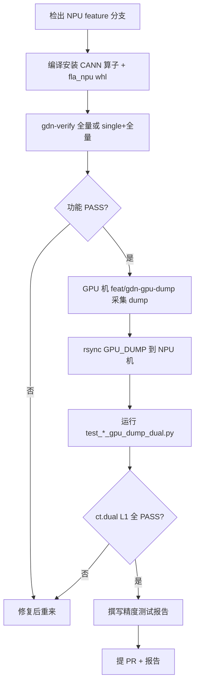

# GDN 算子精度与合入验证指南

> 本文档供**新算子开发**或**既有算子功能修改**时参考。外部贡献者完成下列验证并提交**测试报告**后，方可申请合入 `flash-linear-attention-npu` 主仓。

---

## 1. 验证目标与合入门槛

| 层级 | 目的 | 是否必须 |
|------|------|----------|
| **A. 功能回归** | 编译/安装通过；修改算子 PASS；**其余算子不受影响** | ✅ 必须 |
| **B. GPU 双标杆** | 与 GPU 竞品同输入同精度对比；CPU fp64 作升精度真值 | ✅ 新算子 / 精度相关改动必须 |
| **C. 测试报告** | 结构化 Markdown + 日志/图表附件 | ✅ 必须 |

**合入条件（摘要）**

1. `gdn-verify.sh` 全量或「单算子 + 全量回归」通过，无新增 FAIL/TIMEOUT。
2. 目标算子 GPU 双标杆：`ct.dual` 全部输出 **L1 PASS**（见 §6）。
3. 提交《算子精度测试报告》（模板见 §8），包含环境、用例矩阵、dual 结果、viz 截图路径、日志路径。
4. PR 描述中附报告链接或文件路径。

---

## 2. 代码仓库与分支

### 2.1 NPU 算子仓（本仓）

| 项目 | 链接 |
|------|------|
| 仓库 | https://github.com/Coding-Pangolin/flash-linear-attention-npu |
| 主分支 | `main` |
| GPU 双标杆测试脚本 | [`feat/recompute-wu-gpu-dump-dual`](https://github.com/Coding-Pangolin/flash-linear-attention-npu/tree/feat/recompute-wu-gpu-dump-dual) |

```bash
git clone https://github.com/Coding-Pangolin/flash-linear-attention-npu.git
cd flash-linear-attention-npu
git checkout <your-feature-branch>   # 或合入前基于 main 开发
```

### 2.2 GPU 竞品采集仓（fork）

| 项目 | 链接 |
|------|------|
| 仓库 | https://github.com/Coding-Pangolin/flash-linear-attention |
| GPU dump 分支 | [`feat/gdn-gpu-dump`](https://github.com/Coding-Pangolin/flash-linear-attention/tree/feat/gdn-gpu-dump) |
| 详细采集说明 | 分支内 `GDN_DUMP_GUIDE.md`、`README_GDN_DUMP.md` |

```bash
git clone https://github.com/Coding-Pangolin/flash-linear-attention.git
cd flash-linear-attention
git checkout feat/gdn-gpu-dump
pip install -e .
```

> GPU 机需 CUDA；NPU 机需 CANN + `torch_npu`。dump 数据通过 `rsync`/`scp` 传到 NPU 机即可。

---

## 3. 环境准备

### 3.1 NPU 侧（验证执行机）

```bash
# 1) CANN
source <ASCEND_TOOLKIT_HOME>/set_env.sh

# 2) Python 环境（示例：conda wnc）
conda activate wnc

# 3) 编译安装算子 .run + torch_custom whl（见 README.md / QUICKSTART.md）
bash build.sh --pkg --soc=ascend910b --vendor_name=fla_npu
./build_out/fla-npu-*.run --install-path=$ASCEND_TOOLKIT_HOME --install-for-all --quiet
source $ASCEND_TOOLKIT_HOME/vendors/fla_npu_transformer/bin/set_env.bash

cd torch_custom/fla_npu && bash build.sh && cd ../..

# 4) 精度工具 ct（pip 安装，版本与团队 CI 对齐）
pip install ct   # 含 ct.dual / ct.viz

# 5) 指定 NPU 卡
export TEST_DEVICE_ID=0
```

### 3.2 GPU 侧（dump 采集机）

- CUDA 可用 PyTorch
- 已 checkout `feat/gdn-gpu-dump` 并 `pip install -e .`

---

## 4. 阶段 A：功能回归（不影响其他算子）

使用仓库根目录 **`gdn-verify.sh`** 一键验证：编译 → whl/.run 安装 → 单算子测试 → 整网 example。

### 4.1 全量回归（推荐合入前执行）

```bash
conda activate wnc
source <cann>/set_env.sh

bash gdn-verify.sh --device 0
```

覆盖：

- 多 SOC 编译（按 CANN 版本自动选择 910b / 910_93 / 950）
- `torch_custom/fla_npu/test/test.sh` 内 **9 个算子** smoke
- `examples/flash_gated_delta_rule.py` 整网示例

### 4.2 仅验证本次修改算子（开发中）

```bash
# 只编/测单个算子，但仍建议合入前跑全量
bash gdn-verify.sh --mode single --op chunk_gated_delta_rule_bwd_dhu --device 0
```

`--op` 名称与 **`test.sh` 一致**（`gdn-verify.sh --mode single` 会原样传给 `test.sh`），例如：

| `--op` 名 | 说明 |
|-----------|------|
| `recompute_wu_fwd` | recompute w/u |
| `gdn_fwd_h` | chunk_gated_delta_rule_fwd_h |
| `gdn_fwd_o` | chunk_fwd_o |
| `chunk_bwd_dv_local` | bwd dv local |
| `chunk_gated_delta_rule_bwd_dhu` | bwd_dhu |
| `chunk_bwd_dqkwg` | bwd dqkwg |
| `prepare_wy_repr_bwd_full` | prepare wy repr bwd |
| `prepare_wy_repr_bwd_da` | prepare wy repr bwd (dA) |
| `causal_conv1d` | causal conv1d |

> 注意：编译阶段内部算子目录名可能不同（如 `chunk_fwd_o` vs 测试名 `gdn_fwd_o`）。单算子验证时 `--op` 请用上表 **test.sh 名称**。

### 4.3 跳过编译（已装包时加快迭代）

```bash
bash gdn-verify.sh --skip-compile --device 0
```

### 4.4 直接跑单算子测试脚本

```bash
cd torch_custom/fla_npu/test
export TEST_DEVICE_ID=0
bash test.sh --device 0                              # 全量
bash test.sh --device 0 --op recompute_wu_fwd          # 单个
```

日志目录：`torch_custom/fla_npu/test/test_output/<op>.log`

### 4.5 功能回归通过标准

- 终端汇总 **0 FAIL、0 TIMEOUT**
- 修改算子对应项为 `[PASS]`
- **未修改算子**仍为 `[PASS]`（证明无回归）
- `examples/flash_gated_delta_rule.py` 为 `OK`（全量 `gdn-verify.sh` 时）

---

## 5. 阶段 B：GPU 采集 dump 数据

在 **GPU 机**执行，产出各子算子边界的 `inputs` / `outputs` / `meta`。

### 5.1 批量采集（对齐 cases.json）

```bash
cd flash-linear-attention   # feat/gdn-gpu-dump 分支
chmod +x run_gdn_dump_cases.sh

# 预览（chunk_size=128 会标 [SKIP/gpu]）
./run_gdn_dump_cases.sh --phase 1 --dry-run --dump-dir ./GPU_DUMP

# 一阶段定长/变长
./run_gdn_dump_cases.sh --phase 1 --dump-dir ./GPU_DUMP

# 二阶段 GVA
./run_gdn_dump_cases.sh --phase 2 --dump-dir ./GPU_DUMP --skip-done
```

### 5.2 输出目录结构

```
GPU_DUMP/
  phase_1_fix_1/
    case_meta.json       # B,T,Hk,Hv,K,V,chunk_size,seed,cu_seqlens,...
    manifest.json
    001_recompute_wu.pt  # meta.phase=fwd
    002_fwd_h.pt
    003_fwd_o.pt
    004_recompute_wu.pt  # meta.phase=bwd
    005_bwd_dv_local.pt
    006_bwd_dhu.pt
    007_bwd_dqkwg.pt
    008_prepare_wy_repr_bwd.pt
  dump_report.json
```

### 5.3 `.pt` 文件格式

```python
{
  "op": "bwd_dhu",
  "step": 6,
  "layout": {"storage": "BTHD", "npu": "BHTD transpose on load"},
  "inputs": { ... },   # GPU 布局 [B,T,H,*]
  "outputs": { ... },
  "meta": {
    "scale": 0.088388,
    "chunk_size": 64,
    "cu_seqlens": [0, 128, 256],           # 变长时有
    "chunk_indices_npu": [0,0, 0,1, ...],  # pairwise [seq_idx, chunk_idx]
  },
}
```

### 5.4 GPU 采集限制

| 项 | 说明 |
|----|------|
| `chunk_size` | GPU 竞品路径仅 **64** 可靠；128 的 case 自动跳过，不影响 NPU 单测 |
| 布局 | 默认只存 GPU `[B,T,H,D]`，**不**重复存 NPU 副本 |
| GVA | dump 为原生 GVA：`q/k` 为 Hk，`w/g/do/dv` 等为 Hv |
| gate | cases 默认 `negative_linear`（对齐 NPU 单测）；与 example 的 `logsigmoid` 不同 |

### 5.5 传到 NPU 机

```bash
rsync -av ./GPU_DUMP/ npu-host:/data/GPU_DUMP/
```

---

## 6. 阶段 C：NPU GPU 双标杆

在 **NPU 机**用 GPU dump 作为**同精度标杆**，CPU **fp64** 作为**升精度真值**。

### 6.1 比对语义

```python
ct.dual(npu_out, cpu_fp64_golden, gpu_out_from_dump, level="L1")
```

| 参数 | 角色 |
|------|------|
| `npu_out` | 待测 NPU 算子输出 |
| `cpu_fp64_golden` | CPU 参考实现，中间累加 fp64 |
| `gpu_out_from_dump` | GPU 竞品同 dtype 输出（dump `outputs`） |

通过后可选：

```python
ct.viz(npu_out, cpu_fp64_golden, out_dir="...", name="dh", sample_count=200000)
```

`ct.viz` 绘制 NPU 与 fp64 真值对比图；GPU 竞品精度已由 `ct.dual` 完成比对。

### 6.2 布局转换（加载 dump 时自动完成）

共享模块：`fla/ops/ascendc/gdn/gpu_dump_loader.py`

| 张量类型 | GPU 存储 | NPU 使用 | 转换 |
|----------|----------|----------|------|
| `q,k,v,w,u,g,do,dv,...` | `[B,T,H,*]` | `[B,H,T,*]` | `transpose(1,2)` |
| `h`, `dh` | `[B,NT,H,K,V]` | `[B,H,NT,K,V]` | `permute(0,2,1,3,4)` |
| `h0`, `dht`, `initial_state`, `final_state` | 原样 | 原样 | 不转置 |
| `beta` | 任意 | fp32 | `float()` |

```python
from gpu_dump_loader import load_dump_for_npu

inputs, meta, gpu_outputs = load_dump_for_npu("/data/GPU_DUMP/phase_1_fix_1/006_bwd_dhu.pt")
```

**fwd_h 特例**：NPU `chunk_indices` 参数实际传 **chunk_offsets**（cumsum），脚本内已从 `cu_seqlens` 自动推导；勿直接照搬 dump 的 pairwise `chunk_indices`。

### 6.3 已提供的双标杆脚本

| 算子 | 脚本目录 | 入口 |
|------|----------|------|
| **三算子串行** | `fla/ops/ascendc/gdn/` | `./run_gdn_gpu_dump_dual_all.sh <DUMP_ROOT>` |
| `recompute_wu` | `fla/ops/ascendc/gdn/chunk_gdn_fwd/recompute_wu_fwd/test/` | `./run_recompute_wu_gpu_dump_dual.sh` |
| `fwd_h` | `fla/ops/ascendc/gdn/chunk_gdn_fwd/chunk_gated_delta_rule_fwd_h/tests/` | `./run_fwd_h_gpu_dump_dual.sh` |
| `bwd_dhu` | `fla/ops/ascendc/gdn/chunk_gdn_bwd/chunk_gated_delta_rule_bwd_dhu/test/` | `./run_bwd_dhu_gpu_dump_dual.sh` |

**一键串行三算子**（推荐）：日志、JSON 报告、`ct.viz` 图按算子分目录存放。

```bash
cd fla/ops/ascendc/gdn
chmod +x run_gdn_gpu_dump_dual_all.sh

./run_gdn_gpu_dump_dual_all.sh /data/GPU_DUMP
./run_gdn_gpu_dump_dual_all.sh /data/GPU_DUMP --output-dir /data/gdn_dual_out --case phase_1_fix_1
./run_gdn_gpu_dump_dual_all.sh /data/GPU_DUMP --phase prefix:phase_1_ -sc 100000
```

输出目录结构：

```
<output-dir>/
  recompute_wu/logs/recompute_wu.log
  recompute_wu/recompute_wu_gpu_dump_dual_report.json
  recompute_wu/viz/<case_name>/...
  fwd_h/...
  bwd_dhu/...
  summary.json
```

> 其余 4 个算子（`fwd_o`、`bwd_dv_local`、`bwd_dqkwg`、`prepare_wy_repr_bwd`）可按同目录模式扩展：复用 `gpu_dump_loader.py` + `gpu_dump_dual_utils.py`。

### 6.4 运行示例

```bash
source <cann>/set_env.sh
conda activate wnc
export TEST_DEVICE_ID=0
# 若 vendor 安装路径非默认，补充 LD_LIBRARY_PATH / source set_env.bash

# --- 单个 .pt（推荐调试）---
cd fla/ops/ascendc/gdn/chunk_gdn_bwd/chunk_gated_delta_rule_bwd_dhu/test
./run_bwd_dhu_gpu_dump_dual.sh /data/GPU_DUMP/phase_1_fix_1/006_bwd_dhu.pt -sc 100000

# --- 整个 case 目录 ---
./run_bwd_dhu_gpu_dump_dual.sh /data/GPU_DUMP --case phase_1_fix_1

# --- 批量 phase_1 ---
./run_bwd_dhu_gpu_dump_dual.sh /data/GPU_DUMP --phase prefix:phase_1_

# --- 仅 dual，不出图 ---
python3 test_bwd_dhu_gpu_dump_dual.py --pt /path/to/006_bwd_dhu.pt --no-viz

# --- 多个 pt ---
python3 test_bwd_dhu_gpu_dump_dual.py --pts a.pt,b.pt,c.pt
```

**recompute_wu** 若 fwd/bwd 各有一份 dump，默认取 `meta.phase=bwd`；可用 `--dump-phase fwd`。

### 6.5 输出产物

| 文件 | 位置 |
|------|------|
| JSON 汇总 | `<dump_dir>/<op>_gpu_dump_dual_report.json` |
| ct.viz 图 | `<case或pt目录>/viz/<case_name>/*_Standard.png` |
| 终端日志 | 建议 `tee` 保存，写入报告 |

### 6.6 双标杆通过标准（L1）

`ct.dual` 默认 **level=L1**，需各输出张量均 PASS。典型指标（以 ct 打印为准）：

- `MARE_ratio ≤ 5.0`
- `MERE_ratio ≤ 1.5`
- `RMSE_ratio ≤ 1.5`
- `ERR_COUNT_ratio ≤ 2.0`

各算子须覆盖报告中的**全部输出**（例如 `bwd_dhu` 的 `dh` 与 `dv2` 均 PASS）。

参考报告：

- `torch_custom/fla_npu/test/gva_test_report.md`（fwd_h）
- `torch_custom/fla_npu/test/bwd_dhu_gva_test_report.md`（bwd_dhu）

---

## 7. 新算子接入双标杆（开发者清单）

若新增算子尚未有 `test_*_gpu_dump_dual.py`，按下列步骤扩展：

1. **GPU 侧**：在 `flash-linear-attention` `feat/gdn-gpu-dump` 的 `dump.py` / `chunk.py` 边界插桩 `gdn_dump_op("<op_name>", ...)`，确认 `cases.json` 覆盖目标 shape。
2. **NPU 侧**：在 `fla/ops/ascendc/gdn/<op>/test/` 新增：
   - `test_<op>_gpu_dump_dual.py`（加载 dump → 调 `torch.ops.npu.*` → `dual_then_viz`）
   - `run_<op>_gpu_dump_dual.sh`
3. **Golden**：复用或扩展算子目录内 CPU 参考实现，提供 `accum_dtype=torch.float64` 路径。
4. **布局**：在 `gpu_dump_loader.py` 的 `_BTH_TO_BHT_NAMES` / `_BNTH_TO_BHNT_NAMES` 中登记新张量名。
5. **报告**：按 §8 模板填写。

可抄写的公共代码：

- `fla/ops/ascendc/gdn/gpu_dump_loader.py`
- `fla/ops/ascendc/gdn/gpu_dump_dual_utils.py`
- 已有：`test_recompute_wu_gpu_dump_dual.py`、`test_fwd_h_gpu_dump_dual.py`、`test_bwd_dhu_gpu_dump_dual.py`

---

## 8. 合入测试报告模板

提交文件建议命名：`<op_name>_precision_test_report.md`，放在 PR 描述或 `docs/reports/` 下。

```markdown
# <算子名> 精度测试报告

> PR: #<id>
> 分支: <feature-branch>
> 测试日期: YYYY-MM-DD
> 测试人: <name>

## 一、变更说明

- 需求/缺陷：<简述>
- 影响范围：<kernel / tiling / api / GVA / Vdim 等>

## 二、环境与仓库

| 项目 | 值 |
|------|-----|
| NPU 仓库 | https://github.com/Coding-Pangolin/flash-linear-attention-npu @ `<commit>` |
| GPU 仓库 | https://github.com/Coding-Pangolin/flash-linear-attention @ `feat/gdn-gpu-dump` `<commit>` |
| CANN | e.g. 8.5.0 |
| NPU 型号 | e.g. Ascend910B3 |
| TEST_DEVICE_ID | e.g. 0 |
| Python / conda | e.g. wnc |

## 三、功能回归（gdn-verify / test.sh）

| 项 | 命令 | 结果 |
|----|------|------|
| 全量 gdn-verify | `bash gdn-verify.sh --device N` | PASS / FAIL |
| 目标算子 | `bash gdn-verify.sh --mode single --op <op> --device N` | PASS |
| 整网 example | （含于 gdn-verify） | OK |

未修改算子回归摘要：PASS x / 9，FAIL 0，TIMEOUT 0

日志路径：
- `torch_custom/fla_npu/test/test_output/*.log`
- `/tmp/gdn_*.log`（gdn-verify 编译/安装日志）

## 四、GPU dump 采集

| 项 | 值 |
|----|-----|
| dump 根目录 | `/path/to/GPU_DUMP` |
| cases | e.g. `phase_1_fix_1`, `gva_fix_1`, ... |
| 采集命令 | `./run_gdn_dump_cases.sh --phase ...` |
| dump_report.json | 附路径或摘要 |

## 五、GPU 双标杆（ct.dual）

策略：`ct.dual(npu, cpu_fp64, gpu_dump)`，level=L1

| Case | pt 文件 | 输出 | dual | 备注 |
|------|---------|------|------|------|
| phase_1_fix_1 | 006_bwd_dhu.pt | dh | PASS | |
| ... | ... | dv2 | PASS | |

viz（可选）：
- 目录：`<case>/viz/`
- `-sc` 采样点数：200000

终端日志：`path/to/run.log`

## 六、结论

- [ ] 功能回归通过，无影响其他算子
- [ ] 目标 case 矩阵 dual 全部 PASS
- [ ] 报告与日志已附 PR

## 七、附件清单

1. `*_gpu_dump_dual_report.json`
2. `test_output/*.log` 或 `tee` 的完整运行日志
3. 关键 `ct.viz` 截图（失败 case 必填）
```

---

## 9. 推荐验证流程（总览）



---

## 10. 相关文件索引

| 文件 | 作用 |
|------|------|
| [`gdn-verify.sh`](../gdn-verify.sh) | NPU 仓一键功能验证 |
| [`torch_custom/fla_npu/test/test.sh`](../torch_custom/fla_npu/test/test.sh) | 单算子 smoke 入口 |
| [`ci/run_checks.sh`](../ci/run_checks.sh) | CI 调用 gdn-verify |
| [`fla/ops/ascendc/gdn/gpu_dump_loader.py`](../fla/ops/ascendc/gdn/gpu_dump_loader.py) | dump 加载与布局转换 |
| [`fla/ops/ascendc/gdn/gpu_dump_dual_utils.py`](../fla/ops/ascendc/gdn/gpu_dump_dual_utils.py) | `dual_then_viz`、`-sc` 参数 |
| [`fla/ops/ascendc/gdn/run_gdn_gpu_dump_dual_all.sh`](../fla/ops/ascendc/gdn/run_gdn_gpu_dump_dual_all.sh) | 三算子 GPU 双标杆串行入口 |
| GPU 仓 `GDN_DUMP_GUIDE.md` | GPU 采集完整说明 |
| GPU 仓 `cases.json` | 用例矩阵 |
| 各算子 `README.md` | aclnn 接口与 shape 约束 |

---

## 11. 常见问题

**Q: GPU dump 与 `examples/flash_gated_delta_rule.py` 输入不一致？**  
A: 单算子 dump 走原生 GVA 与 `negative_linear` gate；整网 example 可能对 q/k 做 `repeat_interleave` 且 gate 默认不同。双标杆请以 **dump .pt** 为准。

**Q: chunk_size=128 没有 GPU dump？**  
A: 正常。128 仅跑 NPU 单测 / 随机输入 dual；GPU 双标杆 case 矩阵以 `chunk_size=64` 为主。

**Q: 只改了 Tiling，要跑全量吗？**  
A: 合入前必须全量 `gdn-verify.sh` 或至少 `test.sh` 全算子 + 目标算子 GPU dual 全 case。

**Q: ct 未安装？**  
A: `pip install ct`；确保与团队 CI 版本一致。

---

*文档版本：与 `feat/recompute-wu-gpu-dump-dual` 分支同步。如有流程变更，请在本文件与 GPU 仓 `GDN_DUMP_GUIDE.md` 同步更新。*
