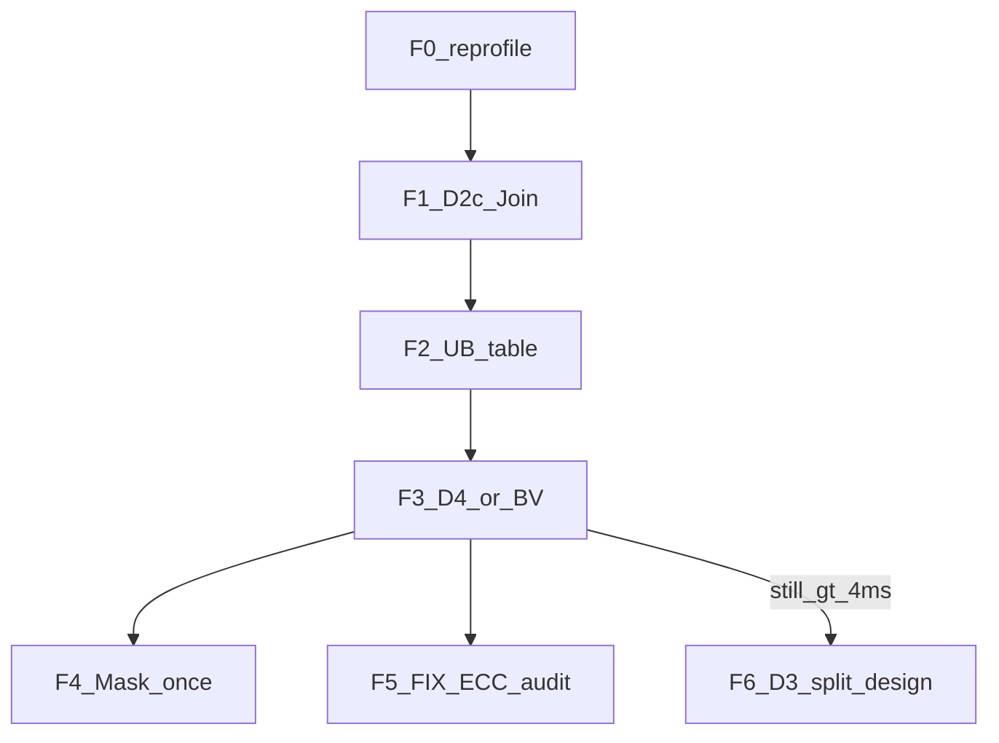

# ChunkKdaBwdWyDqkgFused — 下一轮迭代 Plan（接 ~5.89 ms）

> 日期：2026-07-29  
> 基线：E1 on，model Task Dur ≈ **5.89 ms**；stretch ≤ **0.8 ms**  
> 依据：[OPT_DIRECTION.md](OPT_DIRECTION.md)、[ITER_LOG.md](ITER_LOG.md)、[SIM_T1024_P1A_SUMMARY.md](results/SIM_T1024_P1A_SUMMARY.md)  
> Bound：**AIV-bound**（BAR / wait_id10 / MOVEMASK / MTE_UB_GM）；Cube MMAD≈1%  
> 门禁：单变量宏 · suite 全绿 · Δ ≤ **−0.05 ms** → default on；否则宏回 0、代码保留  
> 有效刀：更新 `ITER_LOG` + commit（不含 `dist/` / opp）

---

## 0. 本轮原则

| 原则 | 说明 |
|------|------|
| 优先砍 AIV 税 | Join / BK 次数 / 真重复 Mask；勿再堆同构 soft-pipe |
| 区分「可修」与「已负向」 | ECC/hang → 正向审计；+ms/flat → 禁止同构重开 |
| Cube dbuf 是辅刀 | 修好正确性后可开，但不当冲 0.8 的主路径 |
| ≤4 ms 靠结构；≤0.8 靠切分 | 见 F 档 D3 |



---

## 1. 刀序总览

| ID | 内容 | 期望 | 风险 | 默认宏试验 |
|----|------|------|------|------------|
| **F0** | 重钉板端（E1 defaults） | 确认 ~5.89 | 无 | — |
| **F1** | D2c：`JoinAivBarrier` 仅留 merge | 降 wait_id10 | hang | `USE_MERGE_BARRIER_ONLY` |
| **F2** | UB 峰值表（BK=128 / BV=128） | go/no-go | — | 文档 only |
| **F3a** | D4：`MAX_BK=128` → nBk=1（F2 过则试） | 中～大 | UB/精度 | `USE_BK128` |
| **F3b** | D3-B：`MAX_BV=128` → nBv=1（F3a 不过或作第二刀） | 中 | UB | `USE_BV128` |
| **F4** | Mask 只做一次（去 Stage3Store 二次 Select） | 小～中 | 精度 | `USE_MASK_ONCE` |
| **F5** | D5：FIX∥MTE2 **正向修 ECC**（L1/Preload 审计） | 正确性→小墙钟 | 507015 | `USE_FIX_MTE2_OVERLAP` |
| **F6** | D3-A：多 kernel / 多 stream **设计+原型** | 冲 0.8 | 接口 | 独立 plan |

**同刀禁止并行开** F3a∩F3b、F5∩L0_DBUF。

---

## 2. F0 — 重钉（不改功能）

当前 default 宏下：

1. `msprof op` + `prof_chunk_kda_bwd_wy_dqkg_fused_model.py` → Task Dur  
2. 记入 `ITER_LOG` / `results/F0_SUMMARY.md`  
3. 确认仍 AIV-bound 后再开 F1

---

## 3. F1 — D2c Join 收紧（优先落地）

**动机**：board `aiv_scalar_wait_id10≈2.9 ms`；`JoinAivBarrier` 散落 Stage0 / Kg / Gate / Epilog / Mask（≈5 处）。E3 砍的是 `PipeBarrier`，本刀动 **AIV↔AIV Join**。

**改法**：

- 行私有路径（owned rows、无共享 WS RAW）**禁止** `JoinAivBarrier`
- **仅保留** db / dgk merge、以及确有跨 AIV 写同一 WS 的点
- 宏：`USE_MERGE_BARRIER_ONLY`（先 1 试验，不过回 0）

**红线**：不改 `C_S*` / `V_*` Set/Wait 次数与顺序；不关 dual-AIV。

**验收**：suite + model 无 hang；Δ ≤ −0.05 ms → default on。

---

## 4. F2 — UB 峰值表（门禁文档）

在改 `MAX_BK` / `MAX_BV` 前写清：

| 配置 | Gate arena（约） | 备注 |
|------|------------------|------|
| 今日 BK=64,BV=64 | `8*BT*BK` f32 ≈ 128KB | 现网 |
| BK=128,BV=64 | ≈ 256KB？ | 可能爆 AtlasA2 192KB |
| BK=64,BV=128 | iv 环减半；scratch `BK*BV` 涨 | 另算 |

产出：`results/UB_PEAK_F2.md` → **过则 F3a/F3b，爆则跳过对应刀**。

---

## 5. F3 — Retile（结构主刀）

### F3a — nBk=1（`USE_BK128`）

- K=128 → 每 head Gate/Epilog 三明治 **×1**（今日 ×2）
- 改 `MAX_BK`（或 tiling 覆盖）+ suite(varlen) + model
- UB 不过 → **停**，转 F3b

### F3b — nBv=1（`USE_BV128`）

- V=128 → Stage0/1/Gate 的 iv 循环减半；与已有 L0C accum 叠加
- 单变量；勿与 F3a 同开

**期望**：向 **≤4 ms** 迈出最大单步；仍 ≫4 ms → 进 F6，勿无限局部刀。

---

## 6. F4 — Mask 只 mask 一次

**动机**：sim MOVEMASK≈12%；E1 已 slim Duplicate/BAR，**Select 主体仍在**；`Stage3StoreVec` 可能二次 Select。

**改法**（只选一种）：

- 若 Epilog/Mask 后面板已因果：Store 路径不再 Select  
- 或 β×Select 同链再并一次终态 BAR（边际小）

宏：`USE_MASK_ONCE`。  
**不做**：再 Init 一张与 P2 `maskBuf_` 重复的表。

---

## 7. F5 — FIX∥MTE2 正向修（辅刀，可与 F4 串行）

**不是**「Vec 税降后再盲开」，而是 **修已知 ECC 根因**：

1. 短 T 开 `USE_FIX_MTE2_OVERLAP=1`，逐步放大到 model  
2. 审计：**PreloadAToL1 / L1 resident** 是否与 outstanding Fix 写冲突  
3. 冲突面：overlap 路径暂关 preload，或分 L1 region；确认 drain（evt=14）  
4. **禁止**同刀开 `USE_L0_AB_DBUF`  
5. model 无 507015 且 Δ≤−0.05 → 可 default on；仅正确性绿、墙钟 flat → 宏 0、记「可安全开的辅路径」

---

## 8. F6 — D3 切分（仍 >4 ms 时立项）

单 kernel 内叠流水已证明不够（E2–E4 / V2）。

**权威设计（已落盘）**：[`SPLIT_KERNEL_PLAN.md`](SPLIT_KERNEL_PLAN.md)

```text
OpA: Stage0+Stage1（+Kg）
OpB: GateWy + Epilog
OpC: Stage3 DaFinal
Host: 同 chunk 同 stream 顺序；跨 chunk 多 stream 重叠
```

本轮交付：设计 + 接口草图（**完成**）。实现编码单独立项。

**F3a'**：裸 BK128 仍 blocked；owned-compact 见 [`results/F3A_ARENA_NOTE.md`](results/F3A_ARENA_NOTE.md)，建议挂 OpB 后做。

---

## 9. 明确不做（禁止同构重试）

| 项 | 原因 |
|----|------|
| `USE_WIN_SOFT_LEAD_V2` 同构 | +0.37 ms，调度对但更慢 |
| `USE_VEC_MTE2_PP_EPILOG` 同构 | +0.30 ms |
| `USE_VS0_ONCE` / `KG_GATE_INTERLEAVE` | +0.12 / +0.06 |
| Gate **无事件**三路 DataCopy | hang；若扩多路须用 **AllocEventID PP**（P1a 形态） |
| I5b Post≻WaitFree | AIV stall |
| F5 未绿时开 L0_AB_DBUF | 曾 ECC |
| D2a/D2b 改 C_S* 批握手（本轮不做） | 高 hang；等 F1 PEM 证明 Wait≫算再单独立项 |

---

## 10. 每刀验证

```bash
FLA_NPU_SOC=ascend910b FLA_NPU_OPS=chunk_kda_bwd_wy_dqkg_fused \
  python -m pip wheel --no-build-isolation --no-deps . -w dist
pip install --force-reinstall --no-deps --no-cache-dir dist/flash_linear_attention_npu-*.whl
# 无 ASCEND_CUSTOM_OPP_PATH / 无仓内 PYTHONPATH
python torch_custom/fla_npu/test/test_npu_chunk_kda_bwd_wy_dqkg_fused.py
msprof op --kernel-name=ChunkKdaBwdWyDqkgFused --aic-metrics=PipeUtilization,BasicInfo \
  --application="python torch_custom/fla_npu/test/prof_chunk_kda_bwd_wy_dqkg_fused_model.py"
```

---

## 11. 成功标准

| 里程碑 | 标准 |
|--------|------|
| F1 | default on 且相对 F0 ≤ −0.05 ms；或 hang→宏 0 |
| F3 | 至少一刀 retile default on，或 UB 文档证明不可行 |
| 务实 | **≤ ~4 ms** |
| F5 | model 无 507015；墙钟有 Δ 才 default on |
| Stretch | ≤ 0.8 ms → 依赖 F6，本轮不承诺必达 |

---

## 12. 一句话

**F1 Join → F2 UB → F3 retile（BK/BV）→ F4 mask-once → F5 修 FIX ECC；仍慢则 F6 切分。**  
禁止重开已负向的 V2 / Epilog PP / VS0 / 无事件三路。
