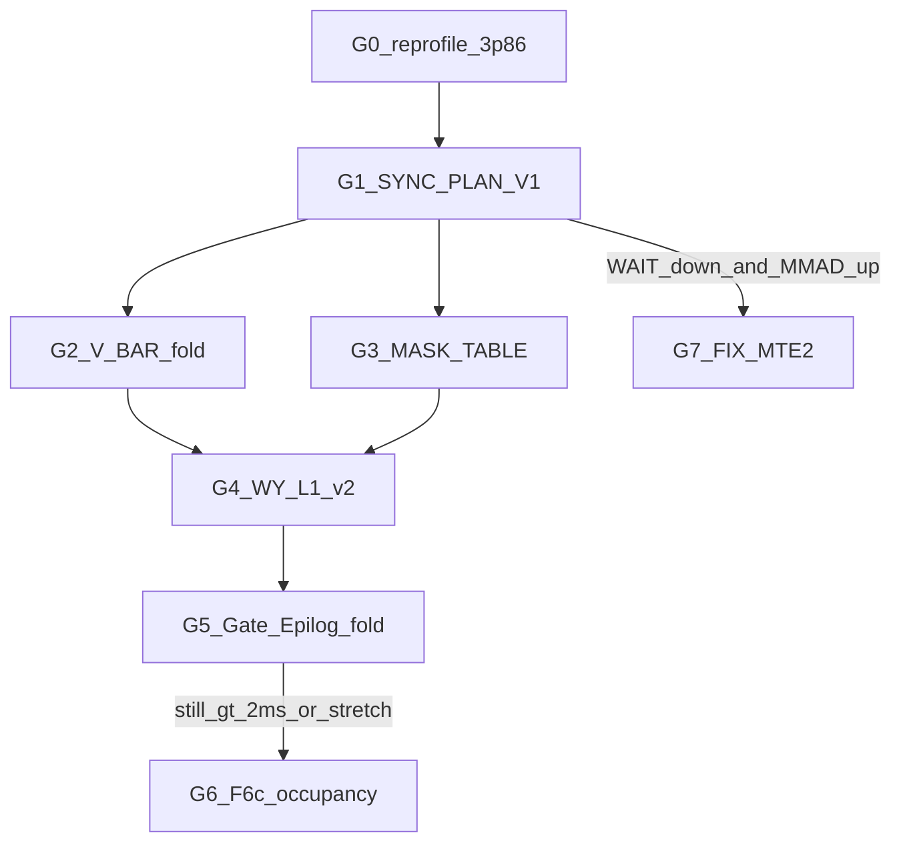

# ChunkKdaBwdWyDqkgFused — G 档迭代 Plan（接 ~3.86 ms）

> 日期：2026-07-29  
> 基线：F3a' on，model Task Dur ≈ **3.86 ms**；stretch ≤ **0.8 ms**  
> 策略源：[`IMPROVEMENT_STRATEGY.md`](IMPROVEMENT_STRATEGY.md)（P0–P7）  
> 板端对照：PR190 WY ≈ **2.28 ms**（仅 WY）；我们含 dqkwg → 理想 WY≈2.3 + dqkwg≈1.5 量级仍远好于今日  
> Bound：**AIV-bound**（CrossCore WAIT / BAR ≫ MMAD）；Cube MMAD≈1%  
> 门禁：单变量宏 · suite 全绿 · Δ ≤ **−0.05 ms** → default on；否则宏回 0、代码保留  
> 有效刀：更新 [`ITER_LOG.md`](ITER_LOG.md) + commit（不含 `dist/` / opp）

**本文件取代** [`NEXT_ITER_PLAN.md`](NEXT_ITER_PLAN.md)（F 档已收束）。F 档结论摘要见下 §0。

---

## 0. F 档收束 → 还剩什么

| IMPROVEMENT_STRATEGY | F 档落地 | G 档裁决 |
|----------------------|----------|----------|
| P5 BK128 owned-arena | **F3a' done** (−0.88 → **3.86**) | **关闭** |
| P6 F6 切分 | MVP+F6b：suite 绿；e2e N1 **41 vs fused 21** | **parked**（冲 stretch 再开 F6c） |
| F1 AIV Join 收紧 | **done** (−0.43）| **关闭**（未动 CrossCore） |
| F3b BV128 | **done** (−0.74）| **关闭** |
| F4 MASK_ONCE | reject (−0.016）| **禁止同构**；改走 G3（P1 后） |
| F5 FIX∥MTE2 | parked ECC | **blocked** 至 G1 后 WAIT↓ |
| P1 同步协议 | **未做** | **G1 主刀** |
| P1b BK 批握手 | — | **跳过**（nBk=1 已等价减半 Gate） |
| P1c V 链 BAR 合并 | `USE_FOLD_BAR_SLIM=0` | **G2** |
| P2 WY L1 resident v2 | 仅有 `USE_L1_A_RESIDENT` | **G4** |
| P3 Mask 表 + 链合并 | Init 有 cache；F4 失败 | **G3**（挂 G1 后） |
| P4 Gate/Epilog 再 fold | `EPILOG_VEC_FOLD=1` | **G5**（审计增量） |
| P7 Fix∥MTE2 | ECC | **G7 后置** |



---

## 1. 原则（继承 + 修订）

| 原则 | 说明 |
|------|------|
| 主矛盾是 sync，不是 dbuf | Sim：Cube WAIT≈28% vs PR190≈14%；先 G1 |
| fused Task Dur 是主指标 | F6 e2e 仅作 stretch；未 ≤ fused×1.15 不开 default |
| 单变量 | 禁止 G1∩G4、G7∩L0_DBUF 同开 |
| 已证伪禁止同构 | V2 soft-pipe / Epilog MTE2 PP / VS0_ONCE / KG_GATE_INTERLEAVE / MASK_ONCE |
| nBk=1 后勿再做 P1b | 握手批处理已被 F3a' 吸收 |

---

## 2. 刀序总览

| ID | 对应策略 | 内容 | 期望 Δ | 风险 | 宏 |
|----|----------|------|--------|------|-----|
| **G0** | P0 | 重钉 3.86 + Sim T1024（BK128 后） | 钉板 | 无 | — |
| **G1** | **P1a** | `WindowSyncPlan`：每 stage/head ≤1× Set；减 redundant CrossCore | **−0.3~−0.8** | hang | `USE_SYNC_PLAN_V1` |
| **G2** | P1c | Gate/Epilog/Mask **V 链末一次** `PipeBarrier` | −0.05~−0.2 | 精度/竞态 | `USE_FOLD_BAR_SLIM` |
| **G3** | P3 | Mask 常量表 + β 同链；**禁止**再开裸 `MASK_ONCE` | −0.05~−0.2 | 精度 | `USE_MASK_TABLE_APPLY` |
| **G4** | P2a | Stage0/3 **A（+可选 K）** 跨 stage L1 resident | −0.2~−0.5 | L1 越界 | `USE_WY_L1_RESIDENT_V2` |
| **G5** | P4 | 审计重复 exp2 / dgk GM 读；Epilog 半行唯一 Join | −0.1~−0.3 | hang | `USE_GATE_EPILOG_FOLD_V2` |
| **G6** | P6+ | F6c：跨 partition **A∥B** 占用（小 WS / 流水） | e2e→≤fused×1.15 | 接口/OOM | `split_stages` 仍 opt-in |
| **G7** | P7 | Fix∥MTE2（仅 G1 后 WAIT↓ 且 MMAD↑） | 小 | 507015 | `USE_FIX_MTE2_OVERLAP` |

**里程碑**

| 阶段 | 板端 med | Sim |
|------|----------|-----|
| G1–G3 后 | **≤ 3.2 ms** | Cube WAIT ≤18%；AIV BAR ≤22% |
| G4–G5 后 | **≤ 2.8~3.0 ms** | ND2NZ↓；tick vs 旧 sim −20%+ |
| Stretch | **≤ 0.8 ms** | 依赖 G6 占用 + 单 Op 短 launch |

---

## 3. G0 — 重钉（不改功能）

BK128 后 sim 基线可能变（nBk=1 → Gate 次数已减半）。G1 前必须：

1. `msprof op` model → 确认 ~**3.86 ms**  
2. `msprof op simulator` T1024 H=2 → 新 `*_instr_exe.csv`：WAIT / BAR / ND2NZ / MOVEMASK  
3. 产出 `results/G0_SUMMARY.md`（对比 [`SIM_T1024_P1A_SUMMARY.md`](results/SIM_T1024_P1A_SUMMARY.md) 与 PR190 COMPARE）

**勿跳过**：否则 G1「次数 −25%」无对照。

---

## 4. G1 — SyncPlan V1（**最高优先级**）

### 动机

F1 只砍 **AIV↔AIV Join**；Sim 仍显示 Cube **WAIT_FLAG_DEV ~2× PR190**。策略 §3.3。

### 改法

1. `common.h`：固定 sync0–5 语义表（WY 映射见策略 §3.3）  
2. Cube/Vec `Process*`：**只读表** Set/Wait；审计 head×BK 重复 Set → **每 stage 每 head ≤1**  
3. **保持**：Kg∥Stage1 互不等（DESIGN §5.2）；禁止 Kg 内 `Wait(C_S1)`  
4. 宏：`USE_SYNC_PLAN_V1=0` → 过门禁改 1

### 验收

| 项 | 标准 |
|----|------|
| suite | 全绿，无 hang |
| Sim | Set/Wait **次数 ≥ −25%**；WAIT ≤18% 或明显下降 |
| Board | Δ ≤ **−0.05 ms** → default on |

### 不做

- 不改数学 / SlotLayout  
- 不同开 G4 L1 重排、G7 Fix overlap

---

## 5. G2 — V 链 PipeBarrier 合并

### 动机

策略 §3.5；`USE_FOLD_BAR_SLIM` 已有宏位=0。Epilog/Gate 多段 store 夹 BAR → AIV BAR 税。

### 改法

- Gate：`exp2→mul beta→mul k` **链末一次** `PipeBarrier<PIPE_V>`  
- Epilog：`dq/dk/dg` 写 GM 前一次 BAR  
- Mask：β×Select 同链末一次 BAR（可与 G3 衔接）

### 验收

suite + Δ ≤ −0.05；sim AIV BAR −≥2pp 更佳。flat → 宏 0。

---

## 6. G3 — Mask 表应用（F4 的正确打开方式）

### 动机

F4 仅去 Store 二次 Select → **−0.016 reject**。策略 §5：须在 **减 sync 后** 再动 Mask，并合并 V 链。

### 改法

1. BT=64 因果位图 Init 一次（已有 `cachedMaskValidRows_` 可扩展）  
2. Stage3 **And/Select only**；partial chunk 只 mask `validRows²`  
3. Mask×β 同链 + 链末 BAR  
4. **禁止**再开裸 `USE_MASK_ONCE` 同构试验  
5. 宏：`USE_MASK_TABLE_APPLY`（新）

### 前置

**G1 default on 或至少 sim WAIT 已降**后再测；否则易再次 flat。

---

## 7. G4 — WY L1 resident v2

### 动机

Sim ND2NZ 14% vs PR190 4.6%；今日仅 A resident，Stage0/3 仍可能二次搬 A。策略 §4.3。

### 改法

1. Stage0：A（+ DW/DU 若 L1 够）整窗 resident  
2. Stage3：**复用** Stage0/2 的 A，禁止二次 GM→L1  
3. 可选 K resident（GVA 注意 hk）  
4. **先写 L1 峰值表** `results/G4_L1_PEAK.md`  
5. 宏：`USE_WY_L1_RESIDENT_V2`

### 验收

sim ND2NZ+FIX ↓；board −0.05；无 L1 越界 / ECC。

---

## 8. G5 — Gate/Epilog fold v2

### 动机

策略 §6；`USE_GATE_REUSE_KG_WS` / `EPILOG_VEC_FOLD` 已开，查 **残留**：

- 是否仍有第二次 `exp2(g)`  
- `dgk`/`gn` 每 BK 是否重复读 GM  
- Dual-AIV store 是否非 merge 点多余 Join（F1 续）

宏：`USE_GATE_EPILOG_FOLD_V2`。期望 −0.1~−0.3；无证据则 skip。

---

## 9. G6 — F6c 占用重叠（stretch）

### 现状

| | e2e |
|--|-----|
| fused | ~21 ms |
| split N1（F6b） | ~41 ms（3 launch）|
| split N2 | ~51 ms |

### 何时开

- G1–G5 后 Task Dur 仍 **> ~2.5 ms**，或业务强制冲 0.8  
- 且接受 opt-in `split_stages`

### 改法方向（择一）

1. **流水**：stream0 `OpB(chunk0)` ∥ stream1 `OpA(chunk1)`（缩小 per-stream WS：`tasksPerCore` 封顶 + `FLA_WY_DQKG_BATCH_TASKS`）  
2. **两刀合**：OpA+OpB 同 launch，仅 OpC 切（减 1× launch）  
3. **Attr API**（去 env，减 host 抖动）— 辅

验收：e2e ≤ **fused×1.15** 才评 default；否则保持 off。详见 [`SPLIT_KERNEL_PLAN.md`](SPLIT_KERNEL_PLAN.md)。

---

## 10. G7 — Fix∥MTE2（后置辅刀）

**全部满足才开**：

1. G1 后 Cube WAIT **明显下降**且 MMAD **上升**  
2. Suite 无 507015  
3. 与 Preload/L1 resident 分区审计完成  

禁止与 G4 同刀；禁止 WAIT≫MMAD 时开。

---

## 11. 明确不做

| 项 | 原因 |
|----|------|
| `USE_WIN_SOFT_LEAD_V2` / Epilog MTE2 PP / VS0 / KG_GATE 同构 | 已负向 |
| 裸 `USE_MASK_ONCE` 再试 | F4 flat；走 G3 |
| `USE_BK_BATCH_HANDSHAKE`（P1b） | nBk=1 已达成 |
| F6 未达 e2e 门禁就 default on | 仍 2× fused |
| G1 前开 G7 / L0_AB_DBUF | WAIT≫MMAD + ECC |
| 单 head 全流水、Kg 挂 Wait(C_S1) | DESIGN §5.2 |

---

## 12. 每刀验证

```bash
source /data/wnc/cann/ascend-toolkit/set_env.sh && conda activate fzy_atk
cd /workspace/fzy/code/kda/0723/flash-linear-attention-npu
FLA_NPU_SOC=ascend910b FLA_NPU_OPS=chunk_kda_bwd_wy_dqkg_fused \
  python -m pip wheel --no-build-isolation --no-deps . -w dist
pip install --force-reinstall --no-deps --no-cache-dir dist/flash_linear_attention_npu-*.whl
# 勿设 ASCEND_CUSTOM_OPP_PATH / 仓内 PYTHONPATH 指残缺 opp
unset ASCEND_CUSTOM_OPP_PATH FLA_WY_DQKG_STAGE FLA_WY_DQKG_TASK_BEGIN FLA_WY_DQKG_TASK_END

python torch_custom/fla_npu/test/test_npu_chunk_kda_bwd_wy_dqkg_fused.py

msprof op --kernel-name=ChunkKdaBwdWyDqkgFused --aic-metrics=PipeUtilization,BasicInfo \
  --application="python torch_custom/fla_npu/test/prof_chunk_kda_bwd_wy_dqkg_fused_model.py"

# G0/G1 必做 sim
export FLA_SIM_T=1024 FLA_SIM_H=2
msprof op simulator --kernel-name=ChunkKdaBwdWyDqkgFused --soc-version=Ascend910B3 \
  --output=fla/ops/ascendc/kda/chunk_kda_bwd_wy_dqkg_fused/results/prof_sim_<tag> \
  --application="python torch_custom/fla_npu/test/prof_chunk_kda_bwd_wy_dqkg_fused_sim.py"
```

---

## 13. 一句话

**G0 钉板 → G1 SyncPlan 砍 CrossCore（主 ROI）→ G2/G3 收 BAR/Mask → G4 L1 resident → G5 扫 Gate 残留；stretch 才 G6 占用，G7 仅 WAIT 解后开 Fix。**  
F 档 retile/Join/F6 MVP 已吃完；禁止重开已证伪 soft-pipe / MASK_ONCE / nBk 批握手。
