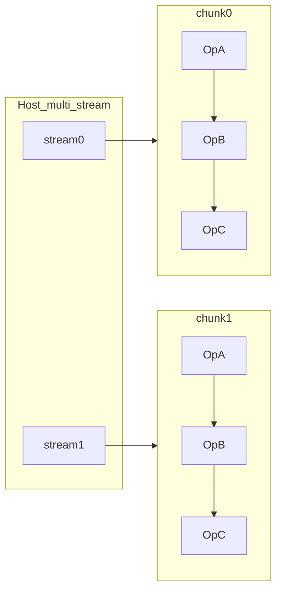

# ChunkKdaBwdWyDqkgFused — F6 多 Kernel 切分 Plan

> 日期：2026-07-29  
> 父文档：[NEXT_ITER_PLAN.md](NEXT_ITER_PLAN.md) §8、[OPT_DIRECTION.md](OPT_DIRECTION.md) §6  
> 板端基线（F1+F3b）：**~4.74 ms**；stretch ≤ **0.8 ms**（≈6×）  
> 本轮交付：**设计 + 接口草图**（可评审）；编码另立项

---

## 1. 为什么必须切

| 事实 | 含义 |
|------|------|
| 单 kernel 已叠 Prefill / Gate PP / Join slim / BV128 | 局部刀边际尽 |
| 仍 AIV-bound（协议 + Epilog/Mask） | 再开 Cube dbuf 墙钟有限且 ECC |
| chunk 间 **无依赖**（DESIGN §1） | Host 多 stream 可叠不同 chunk 的 OpA/B/C |
| 5.9→0.8 需 ~7× | 单 launch 减工作 × 设备占用双管齐下 |

```text
今日 fused（每 chunk × 每 window）:
  Stage0 → [Kg∥S1 → Gate→S2 → Epilog]×nBk → Mask → S3 → Store
  一次 launch 付全量 AIV BAR/握手税

切分后:
  OpA launch: Stage0 + (S1∥Kg)          # 短、Cube 略重
  OpB launch: Gate + S2 + Epilog         # AIV 最重，可单独抠
  OpC launch: Mask + S3 + Store          # MOVEMASK 集中
  Host: 同 chunk 同 stream 顺序；跨 chunk 多 stream 重叠
```

---

## 2. 切分边界（锁定）

对齐现有函数，避免重写数学：

| Op | Cube | Vec | 产出（落 GM / 持久 WS） |
|----|------|-----|-------------------------|
| **OpA** `WyDqkgStageA` | `RunStage0` + `RunStage1`（全 BK） | `Stage0Vec` + `KgVec`（全 BK） | `dv2/db` 写用户 GM；`dq/dk/dw` 面板、`kg/gk/kPark/gPark/gn`、`dAWs/dvb` 进 **stage WS** |
| **OpB** `WyDqkgStageB` | `RunStage2`（全 BK） | `GateOnlyVec` + `EpilogVec`（全 BK） | 更新 `dq/dk/dg` GM；`dAWs` 累加；`dwNeg` 消费于 Cube |
| **OpC** `WyDqkgStageC` | `RunStage3` | `Stage3MaskVec` + `Stage3StoreVec` | `dA/db` 终态 GM |

**不切**：窗内 2-head 成组、dual-AIV 半行、CrossCore `0x2` 语义（各 Op **内部**仍镜像 Cube/Vec）。

**nBk**：OpA/B 仍可用今日 `MAX_BK=64`（或未来 F3a'）；OpC 每 head 一次。



---

## 3. Workspace / 数据契约

### 3.1 持久 stage WS（Op 间）— **修订**

今日 `SlotLayoutF32/T` 按 slot 布局已覆盖中间量。切分后：

- **不可**用「复用 4 rolling slots + 全量 OpA 再 OpB」：OpA 写满窗口后会覆盖尚未被 OpB 消费的中间量。
- **落地（已实现 MVP + F6b）**：
  - `stageId≠0` 时 `numSlots = hv * tasksPerCore`（每核多 task 银行）；Host 默认可一次 launch 覆盖整段 `taskBegin/taskEnd`。
  - A→B→C **同 stream 顺序**；Python 复用同一 `workspace` torch buffer。
  - `FLA_WY_DQKG_BATCH_TASKS` 可缩小批以压 WS（回退到 MVP 式多批）。
  - 控制面暂用 env：`FLA_WY_DQKG_STAGE` / `TASK_BEGIN` / `TASK_END`（后续升 Op Attr）。
- Op 间 **无 CrossCore**；`USE_MASK_SOFT_LEAD` 在 stage 路径关闭（Mask 归 OpC）。

### 3.2 用户张量写回时机


| 张量 | 今日 | 切分后 |
|------|------|--------|
| `dv2` | Stage0Vec | **OpA** |
| `db` | Stage3Store merge | **OpC**（merge 仍在 Store；OpA 只写 `dbMergeWs`） |
| `dq/dk` | Gate / Epilog | **OpB** |
| `dg` | Epilog | **OpB** |
| `dA` | Stage3Store | **OpC** |

### 3.3 分核

保持 `B*NT`（varlen：`chunk_indices`）分核；`HV` 核内窗循环。  
三 Op **必须**相同 `usedCoreNum` / task 解码，避免 WS 错核。

---

## 4. Host / ACLNN 接口草图

```text
# 兼容：默认仍走 fused
aclnnChunkKdaBwdWyDqkgFused(...)
  if (!enable_split) → 现有 fused kernel
  else:
    for task in tasks:                    # 或按 chunk 建图
      stream = streams[task % N_STREAM]
      aclnnWyDqkgStageA(..., ws, stream)  # 同 stream 保序
      aclnnWyDqkgStageB(..., ws, stream)
      aclnnWyDqkgStageC(..., ws, stream)
    sync_all_streams
```

| API | 新增 |
|-----|------|
| `aclnnWyDqkgStageAGetWorkspaceSize` / `aclnnWyDqkgStageA` | OpA |
| `aclnnWyDqkgStageB…` | OpB |
| `aclnnWyDqkgStageC…` | OpC |
| Attr / env | `FLA_WY_DQKG_SPLIT=1` 或 attr `split_stages`（默认 0 保兼容） |

Python：`npu_chunk_kda_bwd_wy_dqkg_fused(..., split_stages=False)`；prof 可开 split + `N` stream。

**N_STREAM 建议**：先 2（与 AIC 核数/占用权衡）；板端扫 1/2/4。

---

## 5. Kernel 落地步骤（实现立项用）

```text
S0  复制目录骨架 ×3（或同目录三 cpp entry）
S1  OpA: 抽 RunWindowStage0 + Stage1/Kg 环；Process 无 Post
S2  OpB: 抽 Gate/S2/Epilog；入口 Wait 无（无跨 launch flag）；读 OpA WS
S3  OpC: Mask/S3/Store；写 dA/db
S4  Host 编排 + workspaceSize = max(A,B,C) 或 sum（若布局不重叠则共享一块）
S5  suite：split=0 与 split=1 对齐 fused golden
S6  msprof：fused vs split(N=1) vs split(N=2)；记 ITER_LOG
```

**精度门禁**：split=1、N=1 必须与 fused 逐 tensor 过现有 atol；再开 N>1。

**性能门禁**：

| 里程碑 | 标准 |
|--------|------|
| split N=1 | 总墙钟 ≤ fused×1.15（允许 launch 税）；单 Op 可 profile |
| split N=2 | model Task 折合或端到端 **≤ 4.0 ms** 优先；冲 0.8 看 Occupancy |
| default | 仅当 N≥2 端到端 Δ 稳定且无回归 |

---

## 6. 风险与缓解

| 风险 | 缓解 |
|------|------|
| 三次 launch 税吃掉收益 | N≥2 重叠；或 OpA+OpB 先合二（两刀） |
| WS 核映射不一致 | 三 Op 共用同一 tiling / core 绑定单测 |
| OpB 过重仍 AIV-bound | OpB 内再 F3a' / Join；或 OpB 按 BK 再拆（慎） |
| 融合语义/API 破坏 | fused 默认保留；split 显式开关 |
| 调试面×3 | 先 N=1 对齐，再多 stream |

---

## 7. 明确不做（本设计）

- 照搬 PR190 整段 `Process` 替换
- 切分同时开 `FIX_MTE2` / L0 dbuf
- 用切分当借口关 dual-AIV
- 首版就 BK 级跨 Op 流水（只做 chunk 级多 stream）

---

## 8. 与 F3a' / F5 关系

| 项 | 关系 |
|----|------|
| F3a' owned-compact BK128 | 可在 **OpB** 单独做，UB 只服务 Gate/Epilog |
| F5 FIX ECC | 切分后 OpA Cube 更重时可再审计；仍非主路径 |
| 今日 fused | 继续作为 golden 与 default |

---

## 9. 验收清单（实现 PR）

- [x] `SPLIT=0` 行为与今日一致（suite fused 绿）
- [x] `SPLIT=1 N=1` suite 全绿
- [x] `SPLIT=1 N=2` model 无 hang；端到端有记录（F6b ~51 ms）
- [x] `ITER_LOG` 一行：fused / split1 / split2 e2e
- [ ] DESIGN.md 增补切分契约小节
- [ ] 性能：e2e ≤ fused×1.15 后再考虑 default（F6b 仍 ~2×）

---

## 10. 一句话

**把融合核拆成 OpA（WyV+KvAcc）/ OpB（GateWy+Epilog）/ OpC（DaFinal），同 chunk 同 stream 保序，跨 chunk 多 stream 叠占用；fused 默认保留。**  
本文件为 F6 权威设计；编码另开 PR。
